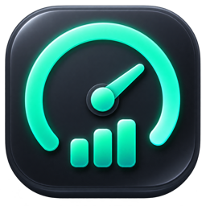

# Codex Bar

[English](README_EN.md) | 简体中文

<p align="center">
  
</p>

Codex Bar 是一个轻量的 macOS 原生工具，用于在菜单栏查看 Codex 的 5 小时和每周剩余额度。

应用启动时会先显示连接面板，确认本机 Codex 登录状态和额度数据。点击“启动菜单栏”后，额度会常驻菜单栏；即使连接失败，也可以从启动面板或菜单栏重新打开设置、选择登录文件并测试连接。

## 功能

- 显示 Codex 5 小时与每周剩余额度、重置时间和套餐类型
- 菜单栏显示当前剩余额度百分比
- 可选择在菜单栏显示 5 小时、每周或同时显示两种剩余额度
- 根据 macOS 系统语言自动显示简体中文或英文
- 启动面板展示连接状态并提供重试
- 支持选择 Codex 登录文件，默认读取 `~/.codex/auth.json`
- 支持 5、15、30 分钟自动刷新
- 自动检测额度重置，并可分别配置 5 小时与每周系统通知
- 设置保存在本机 `UserDefaults`
- 不保存、不展示登录令牌

重置提醒通过连续两次成功刷新之间的剩余额度变化判断：剩余额度明显上涨，或刷新跨过原定重置时间且额度上涨时发送通知。首次加载只建立比较基线，不会误发提醒。每周提醒不设固定时间冷却：同一轮连续上涨只提醒一次，观察到额度下降后会重新等待下一次上涨，因此也能识别官方在周期内提前重置。5 小时提醒默认关闭，每周提醒默认开启，也可以在设置中发送测试提醒。

## 系统要求

- macOS 13 或更高版本
- Xcode 15 或更高版本
- 已通过 Codex CLI 或 Codex 登录，且本机存在有效的 Codex 登录文件

## 构建与运行

1. 克隆仓库：

   ```bash
   git clone https://github.com/hnwangjy/codex-bar.git
   cd codex-bar
   ```

2. 使用 Xcode 打开 `codex_bar.xcodeproj`。
3. 选择 `codex_bar` Scheme 和 `My Mac`，点击 Run。
4. 在启动面板确认连接后，点击“启动菜单栏”。

如果提示没有登录信息，请先运行：

```bash
codex login
```

然后回到应用点击“重新连接”或“测试连接”。

## 隐私与接口说明

Codex Bar 在本机只读解析 Codex 登录文件，并将访问令牌作为 Authorization Header 发送到 ChatGPT 官方域名的额度接口。应用不包含遥测、代理服务，也不会把令牌保存到自己的配置中。

额度接口目前不是公开、稳定的开发者 API，服务地址或返回结构将来可能变化。本项目与 OpenAI 没有隶属或官方合作关系。

## 来源与致谢

本项目的 Codex 认证文件读取方式、额度接口发现和窗口路由思路来源于 [Eric Park 的 CodexIsland](https://github.com/ericjypark/codex-island)。CodexIsland 以 [MIT License](https://github.com/ericjypark/codex-island/blob/main/LICENSE) 开源。

本项目重新实现了面向菜单栏工具的 SwiftUI 界面、启动面板、设置与连接流程，并依据 MIT License 保留上游作者 Eric Park 的版权声明和许可文本。

## License

本项目使用 [MIT License](LICENSE)。其中包含的 CodexIsland 衍生部分保留原作者版权声明。
